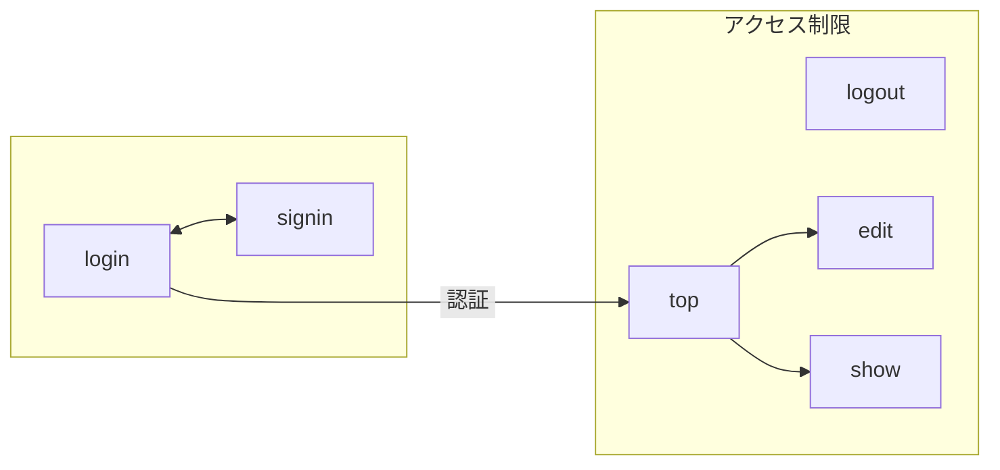
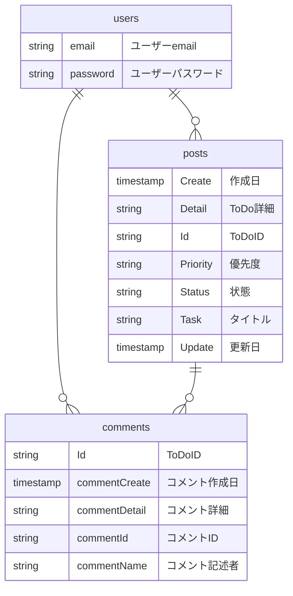

## 公開 URL:

ー

## Github

https://github.com/rmrmrmrmrmrm/230930_todo

## テスト用アカウント

ID ー
Pass ー

## アプリ概要

ToDo

## 作った目的

## 機能

・認証機能（新規登録、サインイン、ログアウト）
・投稿機能（投稿、編集、削除）
・コメント機能（投稿、削除）
・フィルタリング機能
・並び替え機能

## 実装予定機能

ー

## 使用技術

・TypeScript
・React
・Next.js
・storybook

## 画面遷移図

## ER 図

